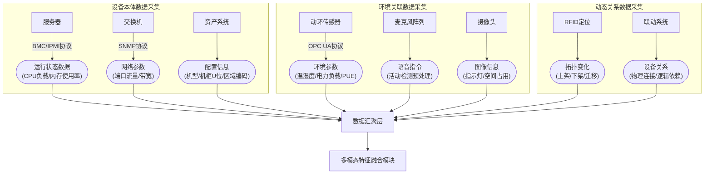

一种基于多模态人工智能融合的数据中心管控方法及系统

一、背景技术

（一）技术领域应用场景

本系统主要适用于数据中心与边缘机房场景。随着业务持续发展，数据中心面临着更为复杂的环境，对可靠性要求也日益提高，亟需解决智能化监控与运维效率问题。

（二）传统技术方案缺陷

1.交互效率瓶颈：运维人员依赖专用终端手动查询动环数据，操作步骤繁杂。在紧急情况下，如应急时需历经 “登录终端→查询告警列表→定位设备→执行操作” 等流程，易导致响应延迟，难以在关键时间内完成处置。

2.决策链路断裂：动环数据与运维经验相互分离，故障诊断只能依靠人工分析。例如在出现高温告警时，需人工关联空调运行状态、设备负载等多源数据，使得处理流程明显滞后于故障发展速度。

3.边缘场景失效：偏远机房因网络不稳定，云端控制方案易出现通信中断，且缺少本地化智能处理能力。一旦断网，便无法执行应急指令，如无法远程关闭异常设备，可能引发连锁故障。

（三）技术发展驱动

随着边缘计算和大模型轻量化技术逐渐成熟，构建 “语音交互 + 动环数据融合 + 本地化决策” 的智能系统成为可能。同时，现有方案普遍缺乏从数据采集到智能决策的闭环协同，难以应对复杂多变的运维场景。

二、发明的内容

（一）系统架构设计

本系统构建了 “数据采集 - 多模态特征融合 - 分析决策 - 执行 - 反馈优化” 的完整闭环，具体由以下多个模块组成：

1.数据层：涵盖数据采集和多模态特征融合。

2.分析层：包含多级协同跟踪、动态预测预警、视觉大模型分析。

3.决策层：涉及语音交互处理、知识库匹配、运维决策生成。

4.执行层：包括控制指令执行和运维结果反馈。

系统架构流程如下：

flowchart TD
    subgraph 数据层
        A[数据采集] --> B[多模态特征融合]
    end
    subgraph 分析层
        B --> C[多级协同跟踪]
        B --> D[动态预测预警]
        B --> E[视觉大模型分析]
    end
    subgraph 决策层
        C --> F[语音交互处理]
        D --> G[知识库匹配]
        E --> G
        F --> H[运维决策生成]
        G --> H
    end
    subgraph 执行层
        H --> I[控制指令执行]
        I --> J[运维结果反馈]
        J --> A
    end
（二）核心模块功能

1.数据采集层：构建覆盖全要素的智能感知网络，实时采集多维度数据并动态追踪设备关系。具体包括：
- 设备本体数据：通过BMC/IPMI协议采集服务器CPU负载、内存使用率、硬盘IO等运行状态；通过SNMP协议获取交换机端口流量、带宽利用率等网络参数；同步记录设备机型配置（如CPU型号、内存容量）及位置信息（机柜U位坐标、机房区域编码）。
- 环境关联数据：动环传感器采集温湿度、电力负载、PUE值等环境参数，采用OPC UA协议传输；麦克风阵列捕捉语音指令并经语音活动检测预处理；摄像头获取设备指示灯状态、机柜空间占用等图像信息。
- 动态关系数据：通过RFID定位与资产系统联动，实时追踪服务器上架/下架、设备迁移等拓扑变化；记录设备间物理连接关系（如服务器-交换机端口映射）及逻辑依赖关系（如主备集群、存储挂载路径）。数据采集流程如下：

具体来说，麦克风阵列由多个麦克风按照特定的几何布局排列组成，各麦克风采集到的语音信号通过线路连接至语音活动检测模块；动环传感器通过物理连接安装在数据中心的设备或环境中，采集到的数据通过网络线路基于 OPC UA 协议传输至后续处理模块；摄像头安装在数据中心合适的监控位置，拍摄的图像数据通过视频线路传输至图像预处理模块。

2.多模态特征融合模块：接收来自数据汇聚层的整合数据（含设备本体数据、环境关联数据及动态关系数据），借助多模态融合引擎，运用模态注意力机制解决语音指令、动环数据与设备图像的跨模态对齐和动态加权问题。在查询场景中，动环数据权重占比 70%；应急控制场景中，语音指令权重占比 80%，以提升复杂场景下语义理解精度。同时，将语音文本词向量（300 维数值型向量）、动环时序特征（LSTM 输出 128 维数值型向量）、设备图像特征（CNN 输出 256 维数值型向量）及关系图谱嵌入（TransE 输出 128 维数值型向量）通过全连接层映射为统一 512 维张量，为后续处理提供标准化输入。

flowchart TD
    I[数据汇聚层] --> A[语音指令数据]
    I --> C[动环数据]
    I --> E[设备图像数据]
    I --> G[动态关系数据]
    
    G --> H["关系图谱嵌入 (TransE, 128维)"]
    A --> B["语音预处理 (语音活动检测)"]
    C --> D["动环数据清洗 (异常值过滤)"]
    E --> F["图像预处理 (目标检测)"]
    
    B --> G1["语音文本词向量提取 (300维)"]
    D --> H1["动环时序特征提取 (LSTM, 128维)"]
    F --> I1["设备图像特征提取 (CNN, 256维)"]
    
    G1 --> J[全连接层映射]
    H --> J
    H1 --> J
    I1 --> J
    J --> K[统一512维张量输出]
    
    subgraph 动态权重调整
        L[查询场景] --> M[动环数据权重70%]
        N[应急控制场景] --> O[语音指令权重80%]
    end
    
    M -.-> K
    O -.-> K

3.多级协同跟踪模块
◦一级跟踪：采用 YOLOv11 的 ByteTrack 算法实现初始目标快速检测与关联，输出带跟踪 ID 的检测结果，保障系统实时性。具体实现时，将视频图像输入到 YOLOv11 模型中，通过模型的卷积神经网络层进行特征提取，然后利用 ByteTrack 算法对检测到的目标进行关联，为每个目标分配唯一的跟踪 ID，并输出检测结果。

◦二级跟踪：运用质心距离与 IOU（交并比）联合匹配策略，对一级结果二次校验，维护目标轨迹历史并计算速度矢量，提高跟踪稳定性。在二级跟踪模块中，接收一级跟踪输出的结果，计算每个目标的质心距离和 IOU，根据设定的阈值进行匹配校验，同时记录目标的轨迹历史信息，通过计算相邻帧之间目标位置的变化来获取速度矢量。

◦协同优化：融合两级跟踪结果，初筛保证实时性（帧率≥15fps），增强跟踪提升复杂场景下稳定性，使目标丢失率降低 30%。通过数据融合模块将一级跟踪和二级跟踪的结果进行融合，先进行初筛操作，去除一些明显错误的检测结果，保证系统的帧率不低于 15fps，然后进一步处理增强跟踪效果，提高在复杂场景下的稳定性。

flowchart TD
    A[视频图像输入] --> B[一级跟踪：YOLOv11的ByteTrack算法]
    B --> C[输出带跟踪ID的检测结果]
    C --> D[二级跟踪：质心距离与IOU联合匹配策略]
    D --> E[维护目标轨迹历史并计算速度矢量]
    E --> F[融合两级跟踪结果]
    F --> G[初筛保证实时性（帧率≥15fps）]
    F --> H[增强跟踪提升稳定性]
    H --> I[目标丢失率降低30%]
    G --> I
1.动态预测预警机制
◦双维度检测：同时判断目标当前位置及基于速度矢量的未来位置（如 5 秒后预测框）是否进入安全区域，实现提前预警。该机制通过接收目标的位置信息和速度矢量信息，分别计算目标当前位置和未来 5 秒后的预测位置，然后与安全区域的边界进行比较判断。

◦时间窗口去重：记录目标最后报警时间戳，设置 120 秒时间窗口，避免重复报警，提升系统可用性。在报警记录模块中，每次报警时记录目标的报警时间戳，当再次检测到相同目标的报警情况时，判断当前时间与上次报警时间戳的差值是否在 120 秒时间窗口内。

◦分级预警：区分 “当前入侵”（红色框 + 声音报警）与 “预测入侵”（黄色框 + 界面提示），支持差异化响应。根据双维度检测的结果，若目标当前位置进入安全区域，则触发 “当前入侵” 预警，在显示界面用红色框标注目标并发出声音报警；若目标未来位置进入安全区域，则触发 “预测入侵” 预警，用黄色框标注并在界面提示。

flowchart TD
    A[目标位置信息输入] --> B[双维度检测：当前位置及5秒后预测框检测]
    B --> C{是否进入安全区域}
    C -->|是| D[记录最后报警时间戳]
    D --> E{是否在120秒时间窗口内重复报警}
    E -->|是| F[不报警]
    E -->|否| G{当前入侵或预测入侵}
    G -->|当前入侵| H[红色框 + 声音报警]
    G -->|预测入侵| I[黄色框 + 界面提示]
    C -->|否| F
1.视觉大模型分析：结合视觉大模型对摄像头实时获取的图像信息深度分析，识别设备状态、异常情况等。例如用户通过手机摄像头拍摄机房照片，大模型可识别图片中的设备信息。视觉大模型部署在服务器端，摄像头采集的图像数据通过网络传输至服务器，大模型利用预训练的模型参数对图像进行特征提取、分类和识别等操作，输出设备状态和异常情况信息。

2.语音交互处理：采用语音 - 控制协同架构，实现语音与控制有效协同。运用 WiFi / 蓝牙双链路通信及本地化大模型部署，断网时自动切换至蓝牙链路维持指令传输。通过麦克风采集用户语音指令，经语音识别和语义理解，实现对机房设备实时问答与状态预测。语音采集模块将采集到的语音信号传输至语音识别模块，语音识别模块将语音转换为文本后传输至语义理解模块，语义理解模块分析文本语义并生成相应的控制指令或查询请求。同时，WiFi 和蓝牙通信模块实时监测网络连接状态，当 WiFi 连接中断时，自动切换至蓝牙链路进行指令传输。

3.知识库匹配：基于知识图谱构建系统，实时更新动环故障处置知识图谱。采用 TransE 知识图谱嵌入算法，将故障实体和关系映射为 128 维向量，支持最大 5 跳深度推理。使用轻量化 BERT 模型对推理链评估，判断其合理性。根据故障情况在知识图谱中查找相关处置方案和建议。知识图谱存储在数据库中，当系统检测到故障时，将故障信息转换为 128 维向量，在知识图谱中进行搜索和推理，通过 TransE 算法计算故障实体之间的关系，利用轻量化 BERT 模型对推理得到的处置方案进行评估，筛选出合理的方案。

4.运维决策生成：综合视觉大模型分析结果、语音交互获取信息以及知识库匹配建议，生成合理运维决策。例如系统检测到 “3 号机柜高温告警” 时，知识图谱直接检索到 “高温→风扇故障” 的 1 跳关系，生成 “重启风扇” 方案；若风扇重启后故障未解除，触发大模型多跳推理，结合历史数据生成 2 跳推理链，建议 “检查 UPS 供电模块”。运维决策生成模块接收来自视觉大模型分析模块、语音交互处理模块和知识库匹配模块的信息，按照预设的决策规则和算法进行综合分析，生成具体的运维决策方案。

5.控制指令执行：根据运维决策生成相应控制指令，通过边缘协同执行模块执行。该模块采用双链路通信，支持断网场景下本地化应急控制指令执行，确保系统可靠性。控制指令生成模块将生成的控制指令传输至边缘协同执行模块，边缘协同执行模块通过 WiFi 或蓝牙链路与设备进行通信，在网络正常时通过 WiFi 链路发送控制指令，网络中断时通过蓝牙链路发送本地化应急控制指令，控制设备执行相应操作。

6.自适应反馈与学习
◦运维闭环优化：运维人员通过语音确认诊断结果（如 “确认风扇故障” ），系统自动标记样本并更新训练数据，每周进行一次模型微调，提升新故障识别准确率。语音确认信息由语音交互处理模块接收并传输至数据管理模块，数据管理模块对样本进行标记和存储，然后按照每周一次的频率将更新后的训练数据提供给模型训练模块，对相关模型进行微调。

◦知识图谱更新：根据新发生的故障情况，自动更新故障因果关系，将新的故障处置方案融入知识图谱训练。当系统处理新的故障时，故障处理模块将新的故障信息和处置方案传输至知识图谱更新模块，知识图谱更新模块对知识图谱中的故障因果关系进行更新，并将新的信息用于知识图谱的训练。

三、具体实施方式

（一）多模态数据采集与处理

1.语音采集与处理
使用麦克风阵列收集语音数据，通过语音识别模型（ASR）将语音转换为文本，最后提取语义特征。麦克风阵列采集的语音信号先经过语音活动检测模块去除静音部分，然后传输至语音识别模型，语音识别模型输出的文本再经过语义分析模块提取语义特征。

flowchart LR
    A[麦克风阵列采集语音数据] --> B[语音活动检测模块去除静音]
    B --> C[语音识别模型（ASR）将语音转换为文本]
    C --> D[语义分析模块提取语义特征]
例如，当运维人员说出 “查询服务器 1 的负载情况” 指令时，麦克风阵列捕捉该语音信号，语音活动检测模块判断语音起止，去除中间的静音片段，将有效语音传输给 ASR 模型转换为 “查询服务器 1 的负载情况” 文本，语义分析模块识别出关键词 “查询”“服务器 1”“负载”，提取出对应的语义特征用于后续处理 。

2. 动环数据采集与处理
采用动环传感器收集温湿度、电力参数等动环数据，通过 OPC UA 协议传输，并利用 LSTM 提取时序特征。动环传感器将采集到的数据按照 OPC UA 协议封装后，通过网络传输至数据处理服务器，在服务器上利用 LSTM 模型对数据进行处理，提取时序特征。

flowchart LR
    E[动环传感器采集温湿度、电力等数据] --> F[按照OPC UA协议封装数据]
    F --> G[通过网络传输至数据处理服务器]
    G --> H[LSTM模型提取时序特征]
假设数据中心某机柜内的温湿度传感器采集到每分钟的温度和湿度数据，传感器将这些数据按照 OPC UA 协议打包成数据帧，通过机房网络发送到数据处理服务器。服务器接收到数据后，LSTM 模型对连续的温度、湿度数据序列进行学习，提取出温度和湿度随时间变化的趋势、波动等时序特征 ，用于后续的分析和决策。

3. 图像数据采集与处理
通过摄像头获取图像信息，使用 CNN 提取设备图像特征。摄像头拍摄的图像经过图像预处理模块进行降噪、裁剪等处理后，输入到 CNN 模型中，CNN 模型通过卷积层和池化层等操作提取设备图像特征。

flowchart LR
    I[摄像头拍摄机房设备图像] --> J[图像预处理模块降噪、裁剪]
    J --> K[CNN模型进行卷积、池化操作]
    K --> L[提取设备图像特征]
比如，摄像头拍摄到机柜内部设备的图像，图像中可能存在因光线问题产生的噪点以及多余的背景部分。图像预处理模块对图像进行中值滤波降噪，并裁剪掉无关的背景区域，只保留设备主体部分。处理后的图像输入到 CNN 模型，模型通过多层卷积操作提取设备的轮廓、接口、指示灯状态等特征，用于判断设备运行状态。

（二）模态融合与诊断预测

1.跨模态交互建模
采用 MM - Transformer 架构，设置多头注意力机制，使语音语义与动环数据通过交叉注意力层实现交互。例如查询 “当前服务器负载” 时，动环数据的 CPU 利用率特征与语音关键词 “负载” 形成注意力权重耦合。

flowchart LR
    M[输入语音语义特征] --> N[多头注意力机制]
    O[输入动环数据特征] --> N
    N --> P[交叉注意力层]
    P --> Q[特征融合输出]
以运维人员询问 “服务器 A 的 CPU 负载” 为例，语音语义特征经过编码后输入到 MM - Transformer 架构，同时服务器 A 对应的动环数据中 CPU 利用率等特征也输入进来。多头注意力机制分别对两种特征进行处理，在交叉注意力层，语音中的 “CPU 负载” 关键词与动环数据中的 CPU 利用率特征相互关联，计算出注意力权重，将两者有效融合，得到包含语音语义和动环数据信息的融合特征。

2. 智能决策输出与模态权重动态调整机制
采用三层触发机制实现模态权重自适应调节，依据指令类型、数据紧急度等因素动态调整语音指令和动环数据权重。例如查询类指令自动提升动环数据权重至 60% - 70%，控制类指令提升语音语义权重至 55% - 65%，应急告警时直接将语音权重锁定为 80% 并屏蔽动态微调。

flowchart LR
    R[接收指令和数据] --> S[指令类型判断模块]
    R --> T[数据紧急度评估模块]
    S --> U[模态权重调整模块]
    T --> U
    U --> V[调整语音指令和动环数据权重]
    V --> W[输出调整后的特征]
当运维人员发出 “调整服务器 B 的风扇转速” 控制指令时，指令类型判断模块识别出这是控制类指令，数据紧急度评估模块评估当前数据紧急程度，两者信息传输给模态权重调整模块。该模块根据预设规则，将语音语义权重提升至 60%，动环数据权重调整为 40%，对语音语义特征和动环数据特征进行加权处理后输出，用于后续的智能决策。

（三）运维决策生成

运维决策生成模块综合视觉大模型分析结果、语音交互获取信息以及知识库匹配建议，生成合理运维决策。该模块基于轻量化的决策 Transformer 模型，并结合 D - S 证据理论实现多源信息融合决策，具体流程如下：

1.信息预处理：来自视觉大模型分析模块的设备图像特征向量、语音交互处理模块的语义特征向量，以及知识库匹配模块输出的故障处置方案概率向量，均先进行归一化处理，将数据映射到 [0, 1] 区间，消除量纲影响。

2.多源信息融合：运用 D - S 证据理论，将上述三种归一化后的信息作为不同证据体。通过计算基本概率分配函数，确定各证据对不同运维决策选项（如 “重启设备”“检查线路”“更换部件” 等）的支持程度，然后使用 Dempster 合成规则，将这些证据进行融合，得到融合后的概率分配结果。

3.决策生成：将融合后的概率分配结果输入到决策 Transformer 模型中，该模型基于预训练的运维决策知识，结合当前数据中心的实时运行状态（如设备负载、网络流量等）作为上下文信息，通过自注意力机制对输入信息进行加权处理，最终输出概率最高的运维决策方案。

flowchart LR
    A[视觉大模型分析结果] --> B[归一化处理]
    C[语音交互获取信息] --> D[归一化处理]
    E[知识库匹配建议] --> F[归一化处理]
    B --> G[D - S证据理论融合]
    D --> G
    F --> G
    G --> H[决策Transformer模型]
    I[实时运行状态] --> H
    H --> J{输出运维决策方案}
例如，当系统检测到 “5 号机柜电力异常告警”，且运维人员通过语音询问 “5 号机柜怎么了” 。此时，视觉大模型分析模块对 5 号机柜摄像头拍摄的图像进行分析，得到电源指示灯闪烁异常的特征向量；语音交互处理模块识别出语音指令中的关键信息 “5 号机柜”，生成语义特征向量；知识库匹配模块在知识图谱中检索，找到 “电力异常→电源模块故障” 的 1 跳关系，输出 “检查电源模块连接” 方案的概率向量。这三部分信息经过归一化处理后，利用 D - S 证据理论融合，再输入决策 Transformer 模型，结合当前机柜的负载、其他设备电力状态等实时运行状态，最终生成 “检查 5 号机柜电源模块连接，若连接正常则进一步检测电源模块电压” 的运维决策方案，供后续控制指令执行模块实施。
（四）自适应反馈与学习

1.运维闭环优化
运维人员对诊断结果进行语音确认后，系统自动更新训练数据，定期进行模型微调，提高新故障识别准确率。语音确认信息触发数据更新流程，系统将相关数据记录并整理后，按照预定的时间周期（每周一次）对模型进行微调，优化模型参数，提升模型对新故障的识别能力。

flowchart LR
    X[运维人员语音确认诊断结果] --> Y[语音交互处理模块接收确认信息]
    Y --> Z[数据管理模块记录并整理数据]
    Z --> AA[每周一次模型训练模块微调模型]
当系统诊断出某服务器硬盘故障并给出处置建议，运维人员检查后通过语音确认 “确实是硬盘故障”。语音交互处理模块接收该确认信息后，传递给数据管理模块，数据管理模块将此次故障的相关数据（如故障现象、诊断过程、处置结果等）进行记录和整理。到每周固定时间，模型训练模块从数据管理模块获取更新后的训练数据，对故障诊断模型进行微调，使模型在后续遇到类似故障时能更准确地识别和诊断。

2. 知识图谱构建与多跳推理机制
采用 “大模型监督 + 图谱多跳推理” 的混合机制，实现故障根因分析和多跳推理。例如系统检测到 “3 号机柜高温告警” 时，知识图谱直接检索到 “高温→风扇故障” 的 1 跳关系，生成 “重启风扇” 方案；若风扇重启后故障未解除，触发大模型多跳推理，结合历史数据生成 2 跳推理链，建议 “检查 UPS 供电模块”。

flowchart LR
    AB[检测到故障（如3号机柜高温告警）] --> AC[知识图谱检索]
    AC --> AD{是否找到1跳关系}
    AD -->|是| AE[生成1跳关系处置方案（如重启风扇）]
    AD -->|否| AF[触发大模型多跳推理]
    AF --> AG[结合历史数据生成多跳推理链]
    AG --> AH[生成多跳推理处置方案]
当系统检测到 3 号机柜温度过高发出告警时，首先在知识图谱中检索与 “高温” 相关的关系，若找到 “高温→风扇故障” 的 1 跳关系，直接生成 “重启风扇” 的处置方案。若执行该方案后高温问题仍未解决，系统触发大模型多跳推理，大模型结合历史上类似高温故障的处理数据、当前机柜的其他动环数据（如电力供应情况、设备负载等），进行多跳推理，生成 “检查 UPS 供电模块” 等更深入的处置建议。

四、有益效果

1.多模态动态融合框架：实现语音语义与动环数据、图像数据等跨模态统一建模，通过注意力机制动态聚焦关键信息，语义理解准确率较传统方案提升 30% 以上。支持 “语音查询 + 实时分析 + 图像识别” 一体化操作，运维效率提升 50% 以上，紧急故障响应时间缩短至 10 秒内。

2.多级协同跟踪架构：创新性将 YOLO 内置跟踪与自定义增强跟踪相结合，两级协同跟踪方案有效解决单级跟踪在复杂场景下鲁棒性不足问题，降低目标丢失率。

3.双维度动态预测预警：突破传统仅依赖当前位置的预警模式，融合实时检测与未来位置预测，能够提前 5 秒预警潜在风险。通过多模态数据融合分析，结合时间窗口去重和分级预警策略，显著提升预警时效性和准确性。

4.基于知识库的多模态决策：构建动环故障处置知识图谱，并与大模型监督机制相结合，实现故障诊断和处置方案自动化推导。降低对专家经验依赖，新手运维人员故障处置效率提升 40%，减少人为误判率。

5.语音交互与边缘协同：实现语音交互与动环数据、图像数据有效融合，结合边缘计算和本地化决策能力，在网络不稳定的边缘场景下也能提供可靠运维支持。

创新点和欲保护点

1. 创新点

•多模态动态融合框架，实现语音、动环数据和图像数据的跨模态统一建模与动态聚焦关键信息。

•多级协同跟踪架构，结合 YOLO 内置跟踪与自定义增强跟踪。

•双维度动态预测预警机制，融合实时与未来位置预测及多模态数据融合分析。

•基于知识库的多模态决策，通过知识图谱与大模型监督结合实现故障诊断与处置推导。

2. 欲保护点​
•多模态动态融合框架：保护跨模态统一建模采用 MM - Transformer 架构结合多头注意力机制的具体方法，包括语音语义与动环数据通过交叉注意力层实现交互的方式；注意力机制运用中，根据不同场景（查询、应急控制等）动态调整语音指令和动环数据权重的具体策略，如查询场景动环数据权重占比 70%、应急控制场景语音指令权重占比 80% 的设定规则；以及实现 “语音查询 + 实时分析 + 图像识别” 一体化操作的完整流程，涵盖从多模态数据采集、特征提取、融合到输出结果的各步骤。​
•多级协同跟踪架构：保护 YOLOv11 的 ByteTrack 算法用于一级跟踪实现初始目标快速检测与关联的具体参数设置及流程；质心距离与 IOU（交并比）联合匹配策略用于二级跟踪的匹配计算方式、参数设定；以及两级跟踪结果融合的具体算法，包括如何通过初筛保证实时性（帧率≥15fps）、增强跟踪提升稳定性的协同机制。​
•双维度动态预测预警机制：保护双维度检测方法中，基于速度矢量计算目标未来位置（如 5 秒后预测框）的具体算法，以及判断目标当前位置及未来位置是否进入安全区域的判定规则；时间窗口去重策略中，120 秒时间窗口的设定依据，记录目标最后报警时间戳并进行重复报警判断的具体流程；分级预警策略里，区分 “当前入侵”（红色框 + 声音报警）与 “预测入侵”（黄色框 + 界面提示）的触发条件和显示控制方法。​
•基于知识库的多模态决策：保护知识图谱构建中，采用 TransE 知识图谱嵌入算法将故障实体和关系映射为 128 维向量的具体实现过程，包括向量维度设定依据、映射算法细节；大模型监督机制中，使用轻量化 BERT 模型对推理链评估的具体评估指标、评估流程；故障诊断与处置推导流程里，从故障发生到知识图谱检索、大模型多跳推理，再到生成处置方案的完整逻辑与步骤，如 “3 号机柜高温告警” 不同情况下的处置方案生成流程。​

提示：1.流程图使用mermaid语法生成