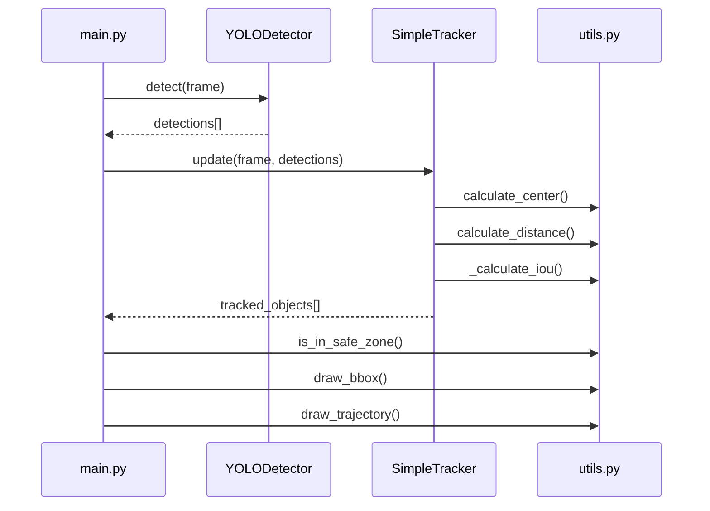
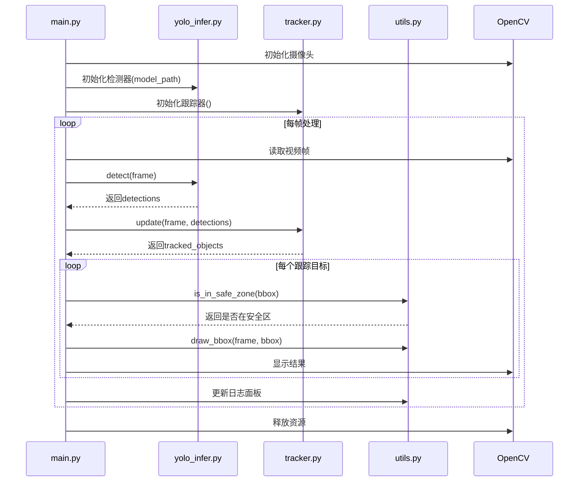

## 项目代码中主要用到了OpenCV的以下功能：
视频采集与显示
cv2.VideoCapture：用于打开摄像头，采集实时视频流。
cv2.imshow：用于实时显示处理后的图像帧。
cv2.waitKey、cv2.destroyAllWindows：用于窗口控制和退出。
图像绘制与可视化
cv2.rectangle：用于在图像上绘制边界框（目标检测框、安全区域、预测框）。
cv2.putText：用于在图像上绘制标签文字（如目标类别、ID）。
cv2.polylines：用于绘制目标的运动轨迹线。
辅助图像处理
OpenCV还用于处理图像的基本操作，如获取帧的宽高、颜色通道等。
总结：
OpenCV在本项目中主要承担了视频流采集、目标和区域的可视化绘制、以及窗口显示等功能，是实现实时目标检测与跟踪系统的基础工具之一。


## 进入安全区域的业务逻辑
安全区域定义
在程序启动时，根据视频帧的尺寸，定义一个矩形安全区域（如画面中心区域）。
目标检测与跟踪
每帧图像先进行目标检测，得到所有目标的边界框（bbox）。
跟踪器为每个目标分配唯一ID，并持续跟踪其位置。
判断目标是否进入安全区域
对每个跟踪目标，取其当前边界框中心点。
dt
如果目标首次进入安全区域，触发一次"警告"并记录该目标ID，避免重复报警。
如果目标离开安全区域，则从报警集合中移除该ID，便于下次重新进入时再次报警。
预测进入安全区域
对每个目标，基于其当前速度和轨迹，预测未来一段时间（如5秒或10秒）后的位置。
判断预测位置是否会进入安全区域。
如果预测将进入安全区域，触发"预警"，并记录该目标ID，避免重复预警。
如果预测位置离开安全区域，则从预警集合中移除该ID。
报警与预警集合管理
使用集合（alerted_objects和predicted_alerted_objects）管理已报警和已预警的目标，防止同一目标反复报警。
伪代码流程
```
for obj in tracked_objects:
    if is_in_safe_zone(obj['bbox'], safe_zone):
        if obj['id'] not in alerted_objects:
            报警并记录ID
    else:
        如果ID已在报警集合，移除

    if is_in_safe_zone(obj['future_bbox'], safe_zone):
        if obj['id'] not in predicted_alerted_objects:
            预警并记录ID
    else:
        如果ID已在预警集合，移除
```
总结
实时性：每帧都进行判断，确保及时报警。
去重机制：通过集合避免重复报警/预警。
预测能力：不仅检测当前进入，还能提前预警未来可能进入的目标。
该业务逻辑保证了系统对安全区域的高效、准确监控，并具备提前预警能力。


## "即将进入安全区域"的预测逻辑总结如下：
1. 预测目标未来位置
在跟踪器 SimpleTracker 中，每个目标都会计算当前速度（基于最近两帧的位置变化）。
使用当前速度，预测目标在未来一段时间（如10秒）后的位置（future_bbox）。
预测方法为：
future_center = current_center + velocity * seconds
预测的边界框大小与当前边界框一致。
2. 判断预测位置是否进入安全区域
在主循环中，对每个跟踪目标，取其预测的 future_bbox。
使用 is_in_safe_zone 函数判断预测中心点是否落在安全区域内。
3. 预警触发与去重
如果预测位置即将进入安全区域，且该目标未被预警过，则触发一次"预警"，并将目标ID加入 predicted_alerted_objects 集合，防止重复预警。
如果预测位置离开安全区域，则从集合中移除该ID，便于下次重新进入时再次预警。
4. 代码关键片段
Apply to 功能介绍.md
5. 总结
预测逻辑核心：利用目标当前速度，线性外推未来位置，判断是否会进入安全区域。
预警机制：只对未预警过的目标触发一次预警，避免重复提醒。
实时性：每帧都进行预测和判断，确保预警及时。
该逻辑实现了对"即将进入安全区域"目标的提前感知和预警，有助于提升系统的主动防护能力。


预警区域
聚焦技术点。
2-三页 把业务流程描述清楚
功能模块
# ppt
技术点

时间表
计划安排

## 核心算法流程说明：

1. 目标检测阶段 ：
   
   - 使用YOLOv8模型进行目标检测（YOLODetector类）
   - 内置ByteTrack算法进行初步跟踪
   - 输出带跟踪ID的检测结果
2. 目标跟踪阶段 ：
   
   - SimpleTracker类实现多目标跟踪
   - 基于质心距离和IOU进行目标匹配
   - 计算目标速度并预测未来位置
   - 维护目标轨迹历史
3. 安全区域检测 ：
   
   - 使用utils.py中的is_in_safe_zone判断目标位置
   - 同时检测当前和预测位置是否进入安全区
4. 可视化输出 ：
   
   - 使用utils.py中的绘图工具绘制边界框和轨迹
   - 实时显示检测和跟踪结果
关键算法特点：

- 采用两级跟踪架构（YOLO内置跟踪+自定义跟踪器）
- 基于速度和位置预测实现提前预警
- 使用时间窗口机制避免重复报警
- 支持多类别目标检测与跟踪



# 以下是AIYolo项目的高层架构时序图（使用Mermaid语法）：


数据流向：
摄像头 → 主程序 → YOLO检测 → 跟踪器更新 → 安全区域判断 → 可视化输出

关键类调用关系说明：

1. main.py 作为主控模块：
   
   - 初始化摄像头、检测器、跟踪器
   - 控制主循环流程
   - 调用各模块功能并整合结果
2. YOLODetector (yolo_infer.py)：
   
   - 封装YOLOv8模型
   - 提供detect()方法进行目标检测
   - 内置ByteTrack跟踪算法
3. SimpleTracker (tracker.py)：
   
   - 维护目标轨迹(tracks)
   - 提供update()方法更新跟踪状态
   - 计算目标速度和预测位置
4. Utils (utils.py)：
   
   - 提供安全区域判断(is_in_safe_zone)
   - 提供绘制功能(draw_bbox等)
   - 提供距离计算等辅助方法
5. OpenCV ：
   
   - 视频采集和显示
   - 基础图像处理功能
